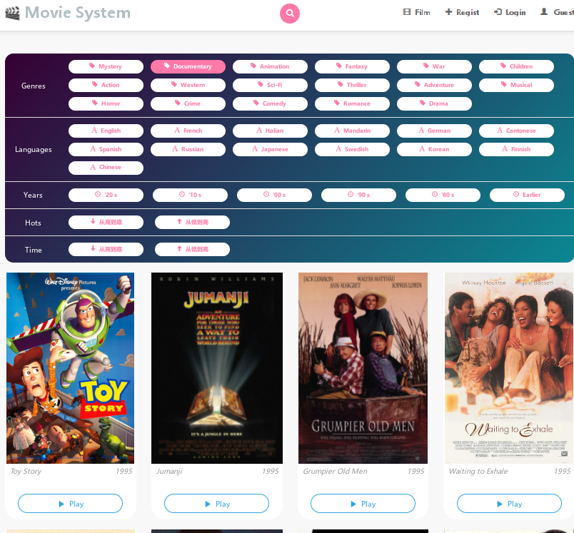
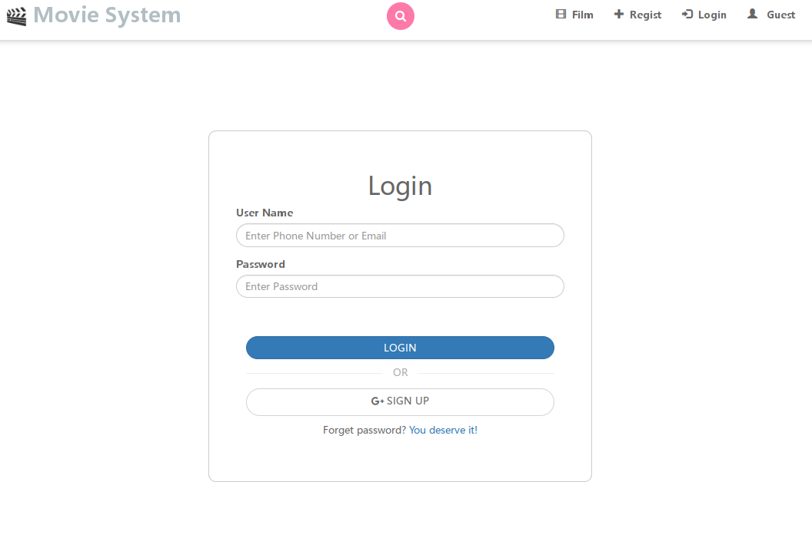
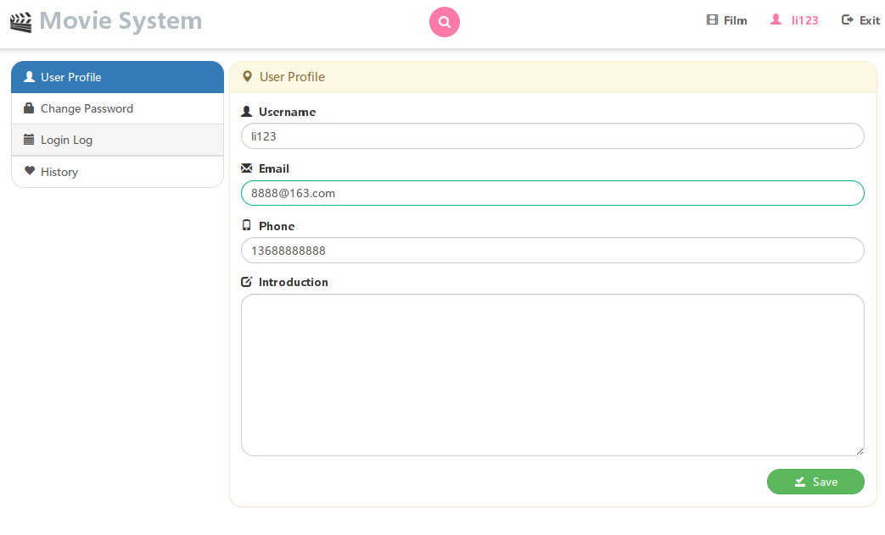
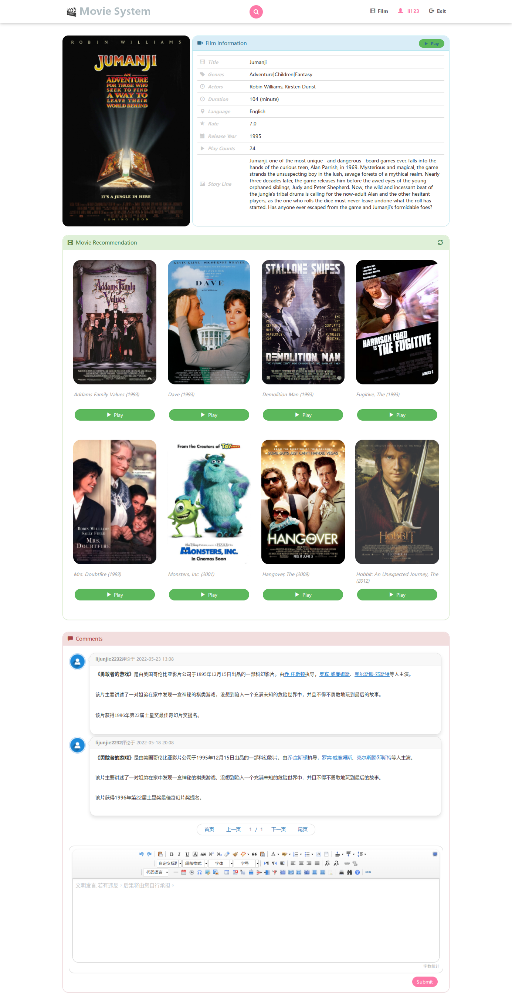
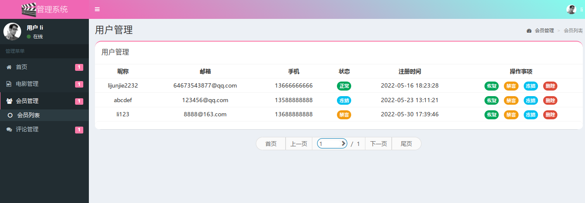

# Movie-rec-sys
##  This is my undergraduate graduation design project
Movie recommendation system modified from https://github.com/hfuuss/python-movie, using Python Flask framwork.

Using NCF model to predict recommendation, details please visit https://github.com/lijunjie2232/NCF-Rec-Sys.

Some folders or files are too large to upload, please contact me if needed.

QQ：2533584225

## 使用说明

--app 代码运行目录    
--movie_env 代码运行环境   

1. source movie_env/bin/active         
1. 运行mysql数据库，在app/__init__.py里面配置数据库账号和密码 
1. sql文件于sql文件夹中
1. 推荐模型默认不加载，第一次请求推荐的时候自动加载（加载较耗时）
1. python manage     #运行程序    
1. 用户界面默认地址 http://127.0.0.1:5000
1. 管理员地址 http://127.0.0.1:5000/admin

## 部分截图

